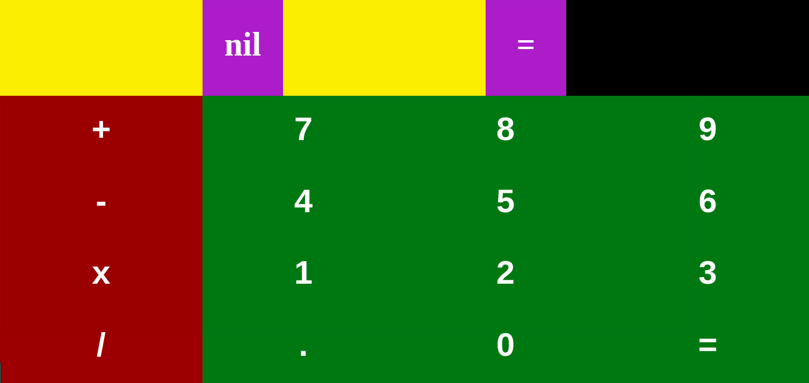

# WASM 101

## Index

* [Description](#description)
* [Instructions](#instructions)
* [Further Reading](#further-reading)
* [Thanks](#thanks)
* [License](#license)

## Description

WebAssembly is a technology that aims to incorporate the native speed and performance from languages like C/C++ into the twenty first century web development.

In other words, **you can run C/C++ code in the browser**

Yes, you read that right.

**No, I'm not kidding.**

_[Go to index](#index)_

## Instructions

1. [Prerequisites](#1-prerequisites)
2. [Write the C/C++ code](#2-write-the-cc-code)
3. [Compile the C/C++ code](#3-compile-the-cc-code)
4. [Download the dynamic library](#4-download-the-dynamic-library)
5. [Add the dynamic library](#5-add-the-dynamic-library)
6. [Call and use the dynamic library](#6-call-and-use-the-dynamic-library)
7. [Deploy the application to see results](#7-deploy-the-application-to-see-results)

_[Go to index](#index)_

### 1. Prerequisites

For this project you will need:

* Web local server (NodeJS, Apache, etc.).
* Text editor (I recommend Atom).

_[Go to instructions](#instructions)_

### 2. Write the C/C++ code

Here you have this C calculator (C++ code is the same in this case):

```c
double addition(double number1, double number2) {
  return number1 + number2;
}
double subtraction(double number1, double number2) {
  return number1 - number2;
}
double multiplication(double number1, double number2) {
  return number1 * number2;
}
double division(double number1, double number2) {
  if (number2 != 0) {
    return number1 / number2;
  } else {
    return 34404;
  }
}
```

**Important**: for the sake of simplicity you don't need to declare any variable or include any header or library.

_[Go to instructions](#instructions)_

### 3. Compile the C/C++ code

Go [here](https://mbebenita.github.io/WasmExplorer/) and paste the code in the red section.

**Tips**:

- You can choose from a bunch of compilers:
  - C89 (C code)
  - C99 (C code)
  - C++98 (C++ code)
  - C++11 (C++ code)
  - C++14 (C++ code)
  - C++1z (C++ code)

- You can choose different levels of optimization:
  - 0 (less optimization)
  - 1
  - 2
  - 3
  - 4
  - 5
  - s (optimization it's over 9000!)

Use `C99` (altought you could use any of them since they have the same syntax, stick with this one for simplicity reasons explained later) and choose the `s` option from the optimization.

Hit the button `compile` and you will see some code appearing in the purple and blue parts.

**The purple part:** This is WAST/WAT code. Is basically WASM human-readable code. Useful to check and debug the compilation.
**The blue part:** This is Assembler code. If you've ever seen it, you'll get pretty much of it.

_[Go to instructions](#instructions)_

### 4. Download the dynamic library

Now, download the file.

If you hit the button `download`, it will compile from WAT to WASM (your magic file) and download it.

Once you have it, move it to your project folder (i.e.: `~/www/wasm-calculator`).

This folder should be inside the _root directory_ (`www` in this case) of your web local server.

_[Go to instructions](#instructions)_

### 5. Add the dynamic library

You are done with the _low-level_ part. Now you have to do some HTML/SCSS/JS to use this magic file.

To add the library and show results on the browser, create the following files:

- index.html
- index.scss
- index.js

You can create those with

```bash
touch index.{html,scss,js}
```

The content should for each one should be:

**index.html**

```html
<html>
<head>
  <title>Web Assembly</title>
	<meta name="viewport" content="width=device-width, initial-scale=1">
  <link rel="stylesheet" href="index.css"/>
  <script src="index.js"></script>
</head>
<body>
  <main>
    <section class="display">
      <span class="operands" id="number1"></span>
      <span class="operation" id="operation">nil</span>
      <span class="operands" id="number2"></span>
      <span class="separator">=</span>
      <span class="result" id="result"></span>
    </section>
    <section class="operations">
      <button id="addition" type="button">+</button>
      <button id="subtraction" type="button">-</button>
      <button id="mutiplication" type="button">x</button>
      <button id="division" type="button">/</button>
    </section>
    <section class="digits">
      <button id="seven" type="button">7</button>
      <button id="eight" type="button">8</button>
      <button id="nine" type="button">9</button>
      <button id="four" type="button">4</button>
      <button id="five" type="button">5</button>
      <button id="six" type="button">6</button>
      <button id="one" type="button">1</button>
      <button id="two" type="button">2</button>
      <button id="three" type="button">3</button>
      <button id="decimal" type="button">.</button>
      <button id="zero" type="button">0</button>
      <button id="equal" type="button">=</button>
    </section>
  </main>
</body>
</html>
```

**index.scss**

```scss
/*
  Title: WASM Calculator
  Author: Marco Maza
  Version: 1.0.0
  Syntax: SCSS
*/

// Palette

// Map to define all the colors you want
$colors: (
  // Chromatic
  black: #000000,
  white: #FFFFFF,
  // Main
  green: #44E60C,
  blue: #00AC83,
  red: #FF1215,
  purple: #873CB8,
  yellow: #F3D301
);

// Shades and Tints

// Trigger
$step: 0;
// $gap * $count must be an integer between 0 and 100
// Both $gap and $count must be integers
$gap: 5;
$count: 5;
// Check if you pay attention to the above conditions
@if $gap * $count >= 0 or $gap * $count <= 100 {
  $gap: $gap;
  $count: $count;
} @else {
  @error 'Out of range: $gap * $count must be an integer between 0 and 100';
}
// Define empty maps for the shades and tints
$shades: ();
$tints: ();
// Function to create shades
@function createShades($color-name, $color-value) {
  $shade: ();
  @for $i from 1 through $count {
    $step: $step + $gap;
    $temp-shade: (
      #{$color-name}-shade-#{$i}: darken($color-value, $step)
    );
    $shade: map-merge($shade, $temp-shade);
  }
  @return $shade;
}
// Function to create tints
@function createTints($color-name, $color-value) {
  $tint: ();
  @for $i from 1 through $count {
    $step: $step + $gap;
    $temp-tint: (
      #{$color-name}-tint-#{$i}: lighten($color-value, $step)
    );
    $tint: map-merge($tint, $temp-tint);
  }
  @return $tint;
}
// Loop to iterate all the colors and call functions
@each $color-name, $color-value in $colors {
  $current-temp-shade: ();
  $current-temp-tint: ();

  $current-shade: createShades($color-name, $color-value);
  $current-temp-shade: (
    #{$color-name}-shades: $current-shade
  );
  $shades: map-merge($shades, $current-temp-shade);

  $current-tint: createTints($color-name, $color-value);
  $current-temp-tint: (
    #{$color-name}-tints: $current-tint
  );
  $tints: map-merge($tints, $current-temp-tint);
}
// Debug your results in the console (uncomment below)
// @debug $shades;
// @debug $tints;
// Use this function to get values recursively inside a map
@function map-deep-get($map, $keys...) {
    @each $key in $keys {
        $map: map-get($map, $key);
    }
    @return $map;
}

// Fonts

// Usually 1rem = 16px in most of the browsers according to the UA stylesheet. However this can be changed by the user in theirs browsers options.
$base: 1rem;

$fonts: ();
// Below arrays are for you to feel with your needs
$font-names: 'xs', 'sm', 'md', 'base', 'lg', 'xl', 'xxl';
$font-sizes: 0.5, 0.75, 0.875, 1, 1.5, 2, 3.5;
// Get the lengths of boths arrays
$font-names-length: length($font-names);
$font-sizes-length: length($font-sizes);
// Check if the length are equal
@if $font-names-length == $font-sizes-length {
  // Loop the map with the font-names length
  @for $i from 1 through $font-names-length {
    $current-name: nth($font-names, $i);
    $current-size: nth($font-sizes, $i);
    $font-temp: (
      font-#{$current-name}: $base * $current-size
    );
    $fonts: map-merge($fonts, $font-temp);
  }
} @else {
  @error 'Lengths from $font-names and $font-sizes are not equal. They must be the same';
}
// Debug your results in the console (uncomment below)
// @debug $fonts;

// Margins and Paddings

$step: 0;
$gap: 0.5;
$count: 10;

$margins: ();
$paddings: ();

@for $i from 1 through $count {
  $step: $step + $gap;
  // Loop the margins' map
  $margin-temp: (
    margin-#{$i}: #{$step}rem
  );
  $margins: map-merge($margins, $margin-temp);
  // Loop the paddings' map
  $padding-temp: (
    padding-#{$i}: #{$step}rem
  );
  $paddings: map-merge($paddings, $padding-temp);
}
// Debug your results in the console (uncomment below)
// @debug $margins;
// @debug $paddings;

// Reset

body {
  margin: 0;
}

// Custom

button {
  border: 0;
  padding: 0;
  font-weight: bold;
  font-size: map-get($fonts, font-lg);
}

main {
  width: 100%;
  height: 100vh;
  display: grid;
  font-weight: bold;
  font-size: map-get($fonts, font-lg);
  grid-template-columns: 25% 75%;
  grid-template-rows: 25% 75%;
  .display {
      grid-column: 1 / 3;
      display: grid;
      grid-template-columns: 25% 10% 25% 10% 30%;
      grid-template-rows: 100%;
      height: 100%;
      text-align: center;
      color: map-deep-get($shades, black-shades, black-shade-1);
    %inline-elements {
      line-height: 25vh;
      font-weight: bold;
    }
    .operands {
      @extend %inline-elements;
      color: map-get($colors, black);
      background: map-deep-get($tints, yellow-tints, yellow-tint-2);
    }
    .operation,
    .separator {
      @extend %inline-elements;
      color: map-get($colors, white);
      background: map-deep-get($tints, purple-tints, purple-tint-2);
    }
    .result {
      @extend %inline-elements;
      color: map-get($colors, white);
      background: map-get($colors, black);
    }
  }
  .operations {
    display: grid;
    grid-template-columns: 100%;
    grid-template-rows: 25% 25% 25% 25%;
    button {
      width: 100%;
      background: map-deep-get($shades, red-shades, red-shade-5);
      color: map-get($colors, white);
    }
  }
  .digits {
    display: grid;
    grid-template-columns: 33.33% 33.33% 33.33%;
    grid-template-rows: 25% 25% 25% 25%;
    button {
      width: 100%;
      background: map-deep-get($shades, green-shades, green-shade-5);
      color: map-get($colors, white);
    }
  }
}

// Media Queries - Bootstrap 4 | Mobile First

// Extra small devices (portrait phones, less than 576px)
// No media query since this is the default in Bootstrap

// Small devices (landscape phones, 576px and up)
@media (min-width: 576px) {}

// Medium devices (tablets, 768px and up)
@media (min-width: 768px) {
  button {
    font-size: map-get($fonts, font-xxl);
  }
  main {
    font-size: map-get($fonts, font-xxl);
  }
}

// Large devices (desktops, 992px and up)
@media (min-width: 992px) {}

// Extra large devices (large desktops, 1200px and up)
@media (min-width: 1200px) {}
```

**index.js**

```js
// Check for wasm support.
if (!('WebAssembly' in window)) {
  console.log("Oops, this browser don't support WebAssembly. Upgrade it! :)");
}

let exports;

let addition, subtraction, multiplication, division;
let number, number1Input, number2Input;
let output;

// Loads a WebAssembly dynamic library, returns a promise.
// function loadWebAssembly(fileName, imports) {
function loadWebAssembly(fileName) {
  return fetch(fileName)
    .then(response => response.arrayBuffer())
    .then(bits => WebAssembly.compile(bits)) // bits a.k.a. buffer
    .then(module => {
      // Create the imports for the module, including the
      // standard dynamic library imports
      // imports = imports || {};
      // imports.env = imports.env || {};
      // imports.env.memoryBase = imports.env.memoryBase || 0;
      // imports.env.tableBase = imports.env.tableBase || 0;
      // if (!imports.env.memory) {
      //   imports.env.memory = new WebAssembly.Memory({ initial: 256 });
      // }
      // if (!imports.env.table) {
      //   imports.env.table = new WebAssembly.Table({ initial: 8, element: 'anyfunc' });
      // }
      // return new WebAssembly.Instance(module, imports);
      return new WebAssembly.Instance(module);
    });
};
// Loads the C module and uses it.
loadWebAssembly('calculatorc.wasm')
  .then(instance => {
    exports = instance.exports; // The "exports" of the instance

    const addition = exports.addition; // Exports the function. For C modules.
    const subtraction = exports.subtraction;
    const multiplication = exports.multiplication;
    const division = exports.division;

    // console.log('Finished compiling! Ready when you are...'); // It's alive!
    // console.log(squarer); // It's really native code!

    const additionTrigger = document.getElementById('addition');
    const subtractionTrigger = document.getElementById('subtraction');
    const multiplicationTrigger = document.getElementById('multiplication');
    const divisionTrigger = document.getElementById('division');

    const equalTrigger = document.getElementById('equal');

    let number1 = document.getElementById('number1');
    let number2 = document.getElementById('number2');

    let operation = document.getElementById('operation');

    let result = document.getElementById('result');

    function execution(event) {
      let keyPressed = event.keyCode;
      let elementClicked = event.path[0].innerText;
      if ((keyPressed == 13 || elementClicked == '=') && operation.innerText != 'nil') {
        if (operation.innerText == '+') {
          result.innerText = addition(number1.innerText, number2.innerText);
        }
        if (operation.innerText == '-') {
          result.innerText = subtraction(number1.innerText, number2.innerText);
        }
        if (operation.innerText == 'x') {
          result.innerText = multiplication(number1.innerText, number2.innerText);
        }
        if (operation.innerText == '/') {
          result.innerText = division(number1.innerText, number2.innerText);
        }
      }
    }
    function operations(event) {
      let keyPressed = event.keyCode;
      let elementClicked = event.path[0].innerText;
      // Operations
      if (keyPressed == 107 || elementClicked == '+') {
        operation.innerText = '+';
      }
      if (keyPressed == 109 || elementClicked == '-') {
        operation.innerText = '-';
      }
      if (keyPressed == 106 || elementClicked == 'x') {
        operation.innerText = 'x';
      }
      if (keyPressed == 111 || elementClicked == '/') {
        operation.innerText = '/';
      }
    }
    function firstOperand(event) {
      let keyPressed = event.keyCode;
      let elementClicked = event.path[0].innerText;
      // First Operand
      if (operation.innerText == 'nil') {
        if (keyPressed == 48 || keyPressed == 96 || elementClicked == '0') {
          number1.innerText = `${number1.innerText}0`;
        }
        if (keyPressed == 49 || keyPressed == 97 || elementClicked == '1') {
          number1.innerText = `${number1.innerText}1`;
        }
        if (keyPressed == 50 || keyPressed == 98 || elementClicked == '2') {
          number1.innerText = `${number1.innerText}2`;
        }
        if (keyPressed == 51 || keyPressed == 99 || elementClicked == '3') {
          number1.innerText = `${number1.innerText}3`;
        }
        if (keyPressed == 52 || keyPressed == 100 || elementClicked == '4') {
          number1.innerText = `${number1.innerText}4`;
        }
        if (keyPressed == 53 || keyPressed == 101 || elementClicked == '5') {
          number1.innerText = `${number1.innerText}5`;
        }
        if (keyPressed == 54 || keyPressed == 102 || elementClicked == '6') {
          number1.innerText = `${number1.innerText}6`;
        }
        if (keyPressed == 55 || keyPressed == 103 || elementClicked == '7') {
          number1.innerText = `${number1.innerText}7`;
        }
        if (keyPressed == 56 || keyPressed == 104 || elementClicked == '8') {
          number1.innerText = `${number1.innerText}8`;
        }
        if (keyPressed == 57 || keyPressed == 105 || elementClicked == '9') {
          number1.innerText = `${number1.innerText}9`;
        }
        // Misc
        if (keyPressed == 110 || keyPressed == 190 || elementClicked == '.') {
          number1.innerText = `${number1.innerText}.`;
        }
      }
    }
    function secondOperand(event) {
      let keyPressed = event.keyCode;
      let elementClicked = event.path[0].innerText;
      // Second Operand
      if (operation.innerText != 'nil') {
        if (keyPressed == 48 || keyPressed == 96 || elementClicked == '0') {
          number2.innerText = `${number2.innerText}0`;
        }
        if (keyPressed == 49 || keyPressed == 97 || elementClicked == '1') {
          number2.innerText = `${number2.innerText}1`;
        }
        if (keyPressed == 50 || keyPressed == 98 || elementClicked == '2') {
          number2.innerText = `${number2.innerText}2`;
        }
        if (keyPressed == 51 || keyPressed == 99 || elementClicked == '3') {
          number2.innerText = `${number2.innerText}3`;
        }
        if (keyPressed == 52 || keyPressed == 100 || elementClicked == '4') {
          number2.innerText = `${number2.innerText}4`;
        }
        if (keyPressed == 53 || keyPressed == 101 || elementClicked == '5') {
          number2.innerText = `${number2.innerText}5`;
        }
        if (keyPressed == 54 || keyPressed == 102 || elementClicked == '6') {
          number2.innerText = `${number2.innerText}6`;
        }
        if (keyPressed == 55 || keyPressed == 103 || elementClicked == '7') {
          number2.innerText = `${number2.innerText}7`;
        }
        if (keyPressed == 56 || keyPressed == 104 || elementClicked == '8') {
          number2.innerText = `${number2.innerText}8`;
        }
        if (keyPressed == 57 || keyPressed == 105 || elementClicked == '9') {
          number2.innerText = `${number2.innerText}9`;
        }
        // Misc
        if (keyPressed == 110 || keyPressed == 190 || elementClicked == '.') {
          number2.innerText = `${number2.innerText}.`;
        }
      }
    }
    function erase() {
      let keyPressed = event.keyCode;
      if (keyPressed == 8 || keyPressed == 46) {
        if (operation.innerText == 'nil') {
          number1.innerText = '';
        } else if (operation.innerText != 'nil' && result.innerText != '') {
          result.innerText = '';
          number2.innerText = '';
        } else if (operation.innerText != 'nil') {
          number2.innerText = '';
          operation.innerText = 'nil';
        }
      }
    }

    document.addEventListener('keyup', firstOperand, false);
    document.addEventListener('click', firstOperand, false);

    document.addEventListener('keyup', operations, false);
    document.addEventListener('click', operations, false);

    document.addEventListener('keyup', secondOperand, false);
    document.addEventListener('click', secondOperand, false);

    document.addEventListener('keyup', erase, false);

    document.addEventListener('keyup', execution, false);
    document.addEventListener('click', execution, false);
});
// Loads the C++ module and uses it.
// loadWebAssembly('calculatorcpp.wasm')
//   .then(instance => {
//     exports = instance.exports; // The "exports" of the instance
//
//     const addition = exports._Z8additiondd; // Exports the function. For C modules.
//     const subtraction = exports._Z11subtractiondd;
//     const multiplication = exports._Z14multiplicationdd;
//     const division = exports._Z8divisiondd;
//
//     // console.log('Finished compiling! Ready when you are...'); // It's alive!
//     // console.log(squarer); // It's really native code!
//
//     const additionTrigger = document.getElementById('addition');
//     const subtractionTrigger = document.getElementById('subtraction');
//     const multiplicationTrigger = document.getElementById('multiplication');
//     const divisionTrigger = document.getElementById('division');
//
//     const equalTrigger = document.getElementById('equal');
//
//     let number1 = document.getElementById('number1');
//     let number2 = document.getElementById('number2');
//
//     let operation = document.getElementById('operation');
//
//     let result = document.getElementById('result');
//
//     function execution(event) {
//       let keyPressed = event.keyCode;
//       let elementClicked = event.path[0].innerText;
//       if ((keyPressed == 13 || elementClicked == '=') && operation.innerText != 'nil') {
//         if (operation.innerText == '+') {
//           result.innerText = addition(number1.innerText, number2.innerText);
//         }
//         if (operation.innerText == '-') {
//           result.innerText = subtraction(number1.innerText, number2.innerText);
//         }
//         if (operation.innerText == 'x') {
//           result.innerText = multiplication(number1.innerText, number2.innerText);
//         }
//         if (operation.innerText == '/') {
//           result.innerText = division(number1.innerText, number2.innerText);
//         }
//       }
//     }
//     function operations(event) {
//       let keyPressed = event.keyCode;
//       let elementClicked = event.path[0].innerText;
//       // Operations
//       if (keyPressed == 107 || elementClicked == '+') {
//         operation.innerText = '+';
//       }
//       if (keyPressed == 109 || elementClicked == '-') {
//         operation.innerText = '-';
//       }
//       if (keyPressed == 106 || elementClicked == 'x') {
//         operation.innerText = 'x';
//       }
//       if (keyPressed == 111 || elementClicked == '/') {
//         operation.innerText = '/';
//       }
//     }
//     function firstOperand(event) {
//       let keyPressed = event.keyCode;
//       let elementClicked = event.path[0].innerText;
//       // First Operand
//       if (operation.innerText == 'nil') {
//         if (keyPressed == 48 || keyPressed == 96 || elementClicked == '0') {
//           number1.innerText = `${number1.innerText}0`;
//         }
//         if (keyPressed == 49 || keyPressed == 97 || elementClicked == '1') {
//           number1.innerText = `${number1.innerText}1`;
//         }
//         if (keyPressed == 50 || keyPressed == 98 || elementClicked == '2') {
//           number1.innerText = `${number1.innerText}2`;
//         }
//         if (keyPressed == 51 || keyPressed == 99 || elementClicked == '3') {
//           number1.innerText = `${number1.innerText}3`;
//         }
//         if (keyPressed == 52 || keyPressed == 100 || elementClicked == '4') {
//           number1.innerText = `${number1.innerText}4`;
//         }
//         if (keyPressed == 53 || keyPressed == 101 || elementClicked == '5') {
//           number1.innerText = `${number1.innerText}5`;
//         }
//         if (keyPressed == 54 || keyPressed == 102 || elementClicked == '6') {
//           number1.innerText = `${number1.innerText}6`;
//         }
//         if (keyPressed == 55 || keyPressed == 103 || elementClicked == '7') {
//           number1.innerText = `${number1.innerText}7`;
//         }
//         if (keyPressed == 56 || keyPressed == 104 || elementClicked == '8') {
//           number1.innerText = `${number1.innerText}8`;
//         }
//         if (keyPressed == 57 || keyPressed == 105 || elementClicked == '9') {
//           number1.innerText = `${number1.innerText}9`;
//         }
//         // Misc
//         if (keyPressed == 110 || keyPressed == 190 || elementClicked == '.') {
//           number1.innerText = `${number1.innerText}.`;
//         }
//       }
//     }
//     function secondOperand(event) {
//       let keyPressed = event.keyCode;
//       let elementClicked = event.path[0].innerText;
//       // Second Operand
//       if (operation.innerText != 'nil') {
//         if (keyPressed == 48 || keyPressed == 96 || elementClicked == '0') {
//           number2.innerText = `${number2.innerText}0`;
//         }
//         if (keyPressed == 49 || keyPressed == 97 || elementClicked == '1') {
//           number2.innerText = `${number2.innerText}1`;
//         }
//         if (keyPressed == 50 || keyPressed == 98 || elementClicked == '2') {
//           number2.innerText = `${number2.innerText}2`;
//         }
//         if (keyPressed == 51 || keyPressed == 99 || elementClicked == '3') {
//           number2.innerText = `${number2.innerText}3`;
//         }
//         if (keyPressed == 52 || keyPressed == 100 || elementClicked == '4') {
//           number2.innerText = `${number2.innerText}4`;
//         }
//         if (keyPressed == 53 || keyPressed == 101 || elementClicked == '5') {
//           number2.innerText = `${number2.innerText}5`;
//         }
//         if (keyPressed == 54 || keyPressed == 102 || elementClicked == '6') {
//           number2.innerText = `${number2.innerText}6`;
//         }
//         if (keyPressed == 55 || keyPressed == 103 || elementClicked == '7') {
//           number2.innerText = `${number2.innerText}7`;
//         }
//         if (keyPressed == 56 || keyPressed == 104 || elementClicked == '8') {
//           number2.innerText = `${number2.innerText}8`;
//         }
//         if (keyPressed == 57 || keyPressed == 105 || elementClicked == '9') {
//           number2.innerText = `${number2.innerText}9`;
//         }
//         // Misc
//         if (keyPressed == 110 || keyPressed == 190 || elementClicked == '.') {
//           number2.innerText = `${number2.innerText}.`;
//         }
//       }
//     }
//     function erase() {
//       let keyPressed = event.keyCode;
//       if (keyPressed == 8 || keyPressed == 46) {
//         if (operation.innerText == 'nil') {
//           number1.innerText = '';
//         } else if (operation.innerText != 'nil' && result.innerText != '') {
//           result.innerText = '';
//           number2.innerText = '';
//         } else if (operation.innerText != 'nil') {
//           number2.innerText = '';
//           operation.innerText = 'nil';
//         }
//       }
//     }
//
//     document.addEventListener('keyup', firstOperand, false);
//     document.addEventListener('click', firstOperand, false);
//
//     document.addEventListener('keyup', operations, false);
//     document.addEventListener('click', operations, false);
//
//     document.addEventListener('keyup', secondOperand, false);
//     document.addEventListener('click', secondOperand, false);
//
//     document.addEventListener('keyup', erase, false);
//
//     document.addEventListener('keyup', execution, false);
//     document.addEventListener('click', execution, false);
// });
```

HTML and SCSS code can stand still. JS is the one making the work for you.

With this part you are defining how to load a WebAssembly dynamic library:

```js
// Loads a WebAssembly dynamic library, returns a promise.
// function loadWebAssembly(fileName, imports) {
function loadWebAssembly(fileName) {
  return fetch(fileName)
    .then(response => response.arrayBuffer())
    .then(bits => WebAssembly.compile(bits)) // bits a.k.a. buffer
    .then(module => {
      // Create the imports for the module, including the
      // standard dynamic library imports
      // imports = imports || {};
      // imports.env = imports.env || {};
      // imports.env.memoryBase = imports.env.memoryBase || 0;
      // imports.env.tableBase = imports.env.tableBase || 0;
      // if (!imports.env.memory) {
      //   imports.env.memory = new WebAssembly.Memory({ initial: 256 });
      // }
      // if (!imports.env.table) {
      //   imports.env.table = new WebAssembly.Table({ initial: 8, element: 'anyfunc' });
      // }
      // return new WebAssembly.Instance(module, imports);
      return new WebAssembly.Instance(module);
    });
};
```

With this part you are calling the function you defined before and passing it the dynamic library (your magic file):

```js
// Loads the C module and uses it.
loadWebAssembly('calculatorc.wasm')
  .then(instance => {
    // More code
  });
```

Particularly, you will see you are _exporting_ the functions from the C code to the function call. This way you can use those functions like a JS function.

```js
exports = instance.exports; // The "exports" of the instance

const addition = exports.addition; // Exports the function. For C modules.
const subtraction = exports.subtraction;
const multiplication = exports.multiplication;
const division = exports.division;
```

The rest of it is pretty much normal JS

_[Go to instructions](#instructions)_

### 6. Call and use the dynamic library

As you may have guessed, you will have to call the JS file from the HTML file to use all of the magic from it.

You can simply do:

```html
<script src="index.js"></script>
```

_[Go to instructions](#instructions)_

### 7. Deploy the application to see results

Now, the moment of the true. Test it out!.

Open [localhost/wasm-calculator](https://localhost/wasm-calculator) in your browser. You should see something like this:



If you don't see this, check the following:

* Review the steps one by one carefully. This is a hard concept to incorporate.
* Check your web local server configuration. Maybe your _root directory_ is not the one you think it is.

_[Go to instructions](#instructions)_

## Further Reading

* [WebAssembly Developers Guide](http://webassembly.org/getting-started/developers-guide/)
* [Standalone WebAssembly Example](https://gist.github.com/kripken/59c67556dc03bb6d57052fedef1e61ab)
* [WebAssembly with only 14 lines of JS](https://medium.freecodecamp.org/get-started-with-webassembly-using-only-14-lines-of-javascript-b37b6aaca1e4)

_[Go to index](#index)_

## Thanks

* [Daniel Simmons](https://medium.freecodecamp.org/@dsimmons_23530)
* [Alon Zakai (kripken)](https://gist.github.com/kripken)
* [WebAssembly Team](http://webassembly.org/community/feedback/)

_[Go to index](#index)_

## License

### The MIT License (MIT)

Copyright © 2018 Marco Maza

Permission is hereby granted, free of charge, to any person obtaining a copy of this software and associated documentation files (the “Software”), to deal in the Software without restriction, including without limitation the rights to use, copy, modify, merge, publish, distribute, sublicense, and/or sell copies of the Software, and to permit persons to whom the Software is furnished to do so, subject to the following conditions:

The above copyright notice and this permission notice shall be included in all copies or substantial portions of the Software.

THE SOFTWARE IS PROVIDED “AS IS”, WITHOUT WARRANTY OF ANY KIND, EXPRESS OR IMPLIED, INCLUDING BUT NOT LIMITED TO THE WARRANTIES OF MERCHANTABILITY, FITNESS FOR A PARTICULAR PURPOSE AND NONINFRINGEMENT. IN NO EVENT SHALL THE AUTHORS OR COPYRIGHT HOLDERS BE LIABLE FOR ANY CLAIM, DAMAGES OR OTHER LIABILITY, WHETHER IN AN ACTION OF CONTRACT, TORT OR OTHERWISE, ARISING FROM, OUT OF OR IN CONNECTION WITH THE SOFTWARE OR THE USE OR OTHER DEALINGS IN THE SOFTWARE.

_[Go to index](#index)_

---

_Per aspera ad astra_
